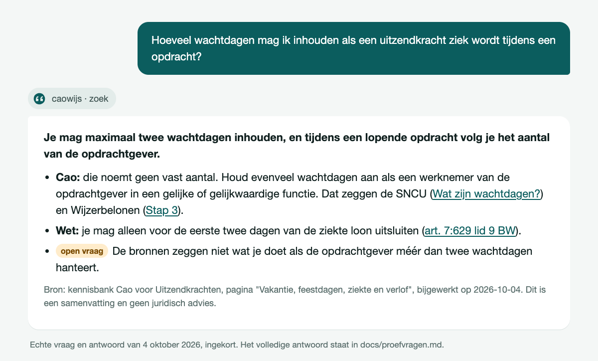
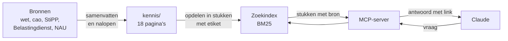

<p align="center">
  <picture>
    <source media="(prefers-color-scheme: dark)" srcset="assets/logo-donker.svg">
    
  </picture>
</p>

<h1 align="center">Caowijs</h1>

<p align="center">
  Laat Claude vragen over de Cao voor Uitzendkrachten beantwoorden, met de bron erbij.
</p>

<p align="center">
  <a href="https://github.com/t1mvdploeg/caowijs/actions/workflows/test.yml"></a>
  
  
</p>



Een taalmodel weet veel, maar niet wat er dit jaar in een cao staat, en het zegt er niet bij waar het iets vandaan heeft. Deze connector geeft Claude een kennisbank over de Cao voor Uitzendkrachten 2026-2028 en de regels eromheen. Elk antwoord verwijst naar de bron: de wet, de cao-tekst of de instantie die het bedrag vaststelt.

Het is een MCP-server: een klein programma op je eigen computer waarmee Claude zelf een bron kan raadplegen.

## Starten

Je hebt Node 22.18 of hoger nodig.

```bash
git clone https://github.com/t1mvdploeg/caowijs.git
cd caowijs && npm install
claude mcp add caowijs -- node "$PWD/src/start.ts"
```

Stel daarna in Claude Code een vraag over de cao. In de Claude-app voeg je dezelfde server toe in het bestand met MCP-servers, met het volledige pad naar `src/start.ts`.

## Wat Claude ermee kan

| Tool | Wat het doet |
| --- | --- |
| `onderwerpen` | Geeft de lijst met onderwerpen, met per pagina de periode en de datum van bijwerken |
| `zoek` | Zoekt op een vraag en geeft de best passende stukken tekst, elk met bron |
| `lees_onderwerp` | Geeft één hele pagina |

Elk stuk tekst heeft een etiket: **geldt nu**, **historie** of **open vraag**. Zo presenteert Claude geen achterhaalde regel als geldend, en zegt het erbij wanneer de bronnen iets niet beantwoorden of elkaar tegenspreken.

Drie echte vragen met het volledige antwoord van Claude staan in [`docs/proefvragen.md`](docs/proefvragen.md).

## Hoe het werkt



- **De kennis** staat in [`kennis/`](kennis/): 18 pagina's in gewone markdown, waarin elke feitelijke bewering een link naar de bron heeft.
- **De server** leest die pagina's bij het starten en deelt ze op in stukken met een etiket.
- **Zoeken** gaat op trefwoorden met BM25, de gangbare formule waarbij een zeldzaam woord zwaarder telt. Een zoekwoord vindt ook samenstellingen: "vergoeding" vindt "transitievergoeding". De keerzijde is een enkele valse treffer bij korte woorden: "tijd" vindt ook "altijd".

De server leest alleen. Hij heeft geen sleutels nodig en maakt geen verbinding met internet.

Er zit bewust geen vectordatabase in. Voor ongeveer 40.000 woorden zijn trefwoorden genoeg: ze kosten niets, geven elke keer dezelfde uitkomst en zijn te testen. Een synoniem dat nergens in de tekst staat vindt hij niet; Claude probeert dan een tweede zoekterm.

## Gemeten kwaliteit

In [`evals/vragen.json`](evals/vragen.json) staan 54 vragen in gewone taal, elk met de pagina waar het antwoord hoort te staan. Ze zijn geschreven voordat de zoekfunctie bestond.

| Meting | Score |
| --- | --- |
| Juiste pagina in de bovenste drie resultaten | 49 van 54 (91%) |
| Juiste pagina op één | 46 van 54 (85%) |

De test faalt onder de 90% in de bovenste drie, dus de marge is één vraag. De zoekfunctie is bijgesteld op dezelfde 54 vragen (de eerste meting gaf 48 van 54), waardoor de score aan de gunstige kant ligt. `npm run meet` herhaalt de meting en toont welke vragen mis gaan.

## Wat het niet doet

- Het geeft geen juridisch advies. Het zijn samenvattingen, met de stand van 4 oktober 2026.
- Het haalt geen nieuwe informatie van internet. Wat na die datum is veranderd, staat er niet in.
- Het draait alleen lokaal.

## Ontwikkelen

```bash
npm test          # alle tests, ook de meting en de controle op de openbare pagina's
npm run typecheck
npm run meet      # de zoekscore op de testvragen
```

Het ontwerp en het plan staan in [`docs/`](docs/).

## Bronnen en licentie

De code valt onder de [MIT-licentie](LICENSE). De kennispagina's zijn samenvattingen in eigen woorden met een link naar de bron; de bronnen zelf blijven van hun rechthebbenden.
