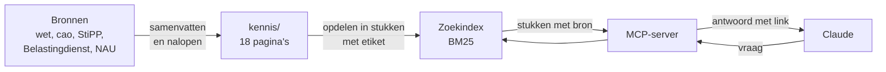

<p align="center">
  <picture>
    <source media="(prefers-color-scheme: dark)" srcset="assets/logo-donker.svg">
    
  </picture>
</p>

<h1 align="center">Cao-connector</h1>

<p align="center">
  Laat Claude vragen over de Cao voor Uitzendkrachten beantwoorden, met de bron erbij.
</p>

<p align="center">
  <a href="https://github.com/t1mvdploeg/cao-connector/actions/workflows/test.yml"></a>
  
  
</p>


Een taalmodel weet veel, maar niet wat er dit jaar in een cao staat, en het zegt er niet bij waar het iets vandaan heeft. Deze connector geeft Claude een kennisbank over de Cao voor Uitzendkrachten 2026-2028 en de regels eromheen. Elk antwoord verwijst naar de bron: de wet, de cao-tekst of de instantie die het bedrag vaststelt.

Het is een MCP-server: een klein programma op je eigen computer waarmee Claude zelf een bron kan raadplegen.

## Starten

Je hebt Node 22.18 of hoger nodig.

```bash
git clone https://github.com/t1mvdploeg/cao-connector.git
cd cao-connector && npm install
claude mcp add cao -- node "$PWD/src/start.ts"
```

Stel daarna in Claude Code een vraag over de cao. In de Claude-app voeg je dezelfde server toe in het bestand met MCP-servers, met het volledige pad naar `src/start.ts`.

## Voorbeeld

> Hoeveel wachtdagen mag ik inhouden als een uitzendkracht ziek wordt tijdens een opdracht?

**Je mag maximaal twee wachtdagen inhouden, en tijdens een lopende opdracht volg je het aantal van de opdrachtgever.** Een wachtdag is een dag aan het begin van de ziekte waarover je geen loon doorbetaalt.

- **Cao:** die noemt geen vast aantal. Houd evenveel wachtdagen aan als een werknemer van de opdrachtgever in een gelijke of gelijkwaardige functie. Dat zeggen de SNCU ([Wat zijn wachtdagen?](https://www.sncu.nl/alle-themas/ziekte/wat-zijn-wachtdagen/)) en Wijzerbelonen ([Stap 3](https://www.wijzerbelonen.nl/stap-3-vaststellen-gelijkwaardige-beloning/)).
- **Wet:** je mag alleen voor de eerste twee dagen van de ziekte loon uitsluiten ([art. 7:629 lid 9 BW](https://wetten.overheid.nl/BWBR0005290/2026-07-01/#Boek7_Titeldeel10_Afdeling2_Artikel629)).
- **Na afloop van de opdracht:** de cao noemt dan wel een vast aantal, namelijk één wachtdag (art. 41 lid 2).

**Open vraag:** de bronnen zeggen niet wat je doet als de opdrachtgever méér dan twee wachtdagen hanteert. Zoek dit na als het speelt.

Het antwoord is ingekort; het volledige antwoord staat, met twee andere vragen, in [`docs/proefvragen.md`](docs/proefvragen.md). Let op de laatste regel: wat de bronnen niet beantwoorden, zegt Claude ook.

## Wat Claude ermee kan

| Tool | Wat het doet |
| --- | --- |
| `onderwerpen` | Geeft de lijst met onderwerpen, met per pagina de periode en de datum van bijwerken |
| `zoek` | Zoekt op een vraag en geeft de best passende stukken tekst, elk met bron |
| `lees_onderwerp` | Geeft één hele pagina |

Elk stuk tekst heeft een etiket: **geldt nu**, **historie** of **open vraag**. Zo presenteert Claude geen achterhaalde regel als geldend, en zegt het erbij wanneer de bronnen iets niet beantwoorden of elkaar tegenspreken.

## Hoe het werkt



- **De kennis** staat in [`kennis/`](kennis/): 18 pagina's in gewone markdown, elk met de vaste opbouw Kern, Details, Historie, Open vragen en Bronnen. Elke feitelijke bewering heeft een link naar de bron.
- **De server** leest die pagina's bij het starten en deelt ze op in stukken: per kop, en daarbinnen per opsommingspunt, alinea of tabel.
- **Zoeken** gaat op trefwoorden met BM25, de gangbare formule waarbij een zeldzaam woord zwaarder telt dan een veelvoorkomend woord. Een zoekwoord vindt ook samenstellingen: "vergoeding" vindt "transitievergoeding". Het vindt dus ook een woord binnen een ander woord; dat helpt bij samenstellingen en geeft enkele valse treffers bij korte woorden.

De server leest alleen. Hij heeft geen sleutels nodig en maakt geen verbinding met internet.

### Waarom geen vectordatabase

Zoeken op betekenis vraagt een extern model of een download, en geeft bij een nieuwe versie van dat model een andere uitkomst. Voor ongeveer 40.000 woorden is dat niet nodig: trefwoorden zijn gratis, geven elke keer dezelfde uitkomst en zijn te testen. De grens ligt bij synoniemen die nergens in de tekst staan. Claude vangt dat op door een tweede zoekterm te proberen. Bij een kennisbank die tien keer zo groot is, of met vragen in heel andere woorden dan de tekst, zou ik beide combineren.

## Gemeten kwaliteit

In [`evals/vragen.json`](evals/vragen.json) staan 54 vragen in gewone taal, elk met de pagina waar het antwoord hoort te staan. Ze zijn geschreven voordat de zoekfunctie bestond. De meeste vragen zijn gesteld vanuit het uitzendbureau (intercedent, back office); weinig vanuit de uitzendkracht.

| Meting | Score |
| --- | --- |
| Juiste pagina in de bovenste drie resultaten | 49 van 54 (91%) |
| Juiste pagina op één | 46 van 54 (85%) |

`npm run meet` herhaalt de meting en toont ook welke vragen mis gaan. Hoe het zover kwam, en hoe ver je het getal mag vertrouwen:

- De eerste meting, vóór er iets was bijgesteld, gaf 48 van 54 (89%) in de bovenste drie en 44 van 54 (81%) op één.
- Daarna volgden twee algemene aanpassingen: woorden uit de titel van een pagina tellen zwaarder, en de korte omschrijving van elke pagina telt mee. Er is geen lijst met synoniemen bijgekomen en geen regel voor één enkele vraag.
- De zoekfunctie is bijgesteld op dezelfde 54 vragen waarmee ze wordt gemeten; er is geen aparte set achtergehouden. De score ligt daardoor aan de gunstige kant.
- De marge is één vraag: bij 48 van 54 faalt de test, die de grens legt op 90% in de bovenste drie.
- De vragen die mis gaan, verwarren verwante pagina's. Een voorbeeld: op de vraag of je de reiskostenvergoeding mag meetellen om op het minimumloon uit te komen, komt eerst de pagina over toeslagen, overwerk en reiskosten, terwijl het antwoord op de pagina over het minimumloon hoort te staan.

## Hoe de kennisbank is gemaakt

De pagina's zijn samenvattingen van openbare bronnen. Per groep pagina's schreef één AI-agent de tekst; daarna zocht een tweede agent, die de tekst niet had geschreven, elke bewering terug in de bron. Die tweede ronde verbeterde ongeveer één op de zes beweringen, meestal een weggelaten voorwaarde (de telling staat in [`docs/werkwijze/uitkomst.md`](docs/werkwijze/uitkomst.md)). De opdrachten die de agents kregen staan in [`docs/werkwijze/`](docs/werkwijze/).

Rangorde van bronnen: wetstekst, dan de cao-tekst, dan de instantie die iets vaststelt of uitvoert, dan uitleg van derden.

## Wat het niet doet

- Het geeft geen juridisch advies. Het zijn samenvattingen, met de stand van 4 oktober 2026.
- Het haalt geen nieuwe informatie van internet. Wat na die datum is veranderd, staat er niet in.
- Het draait alleen lokaal.

## Ontwikkelen

```bash
npm test          # alle tests, ook de meting en de controle op de openbare pagina's
npm run typecheck
npm run meet      # de zoekscore op de testvragen
```

Het ontwerp en het plan staan in [`docs/`](docs/).

## Bronnen en licentie

De code valt onder de [MIT-licentie](LICENSE). De kennispagina's zijn samenvattingen in eigen woorden met een link naar de bron; de bronnen zelf blijven van hun rechthebbenden.
