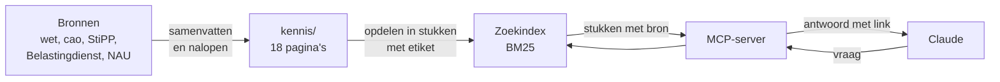

# Cao-connector: implementatieplan

> **For agentic workers:** REQUIRED SUB-SKILL: Use superpowers:subagent-driven-development (recommended) or superpowers:executing-plans to implement this plan task-by-task. Steps use checkbox (`- [ ]`) syntax for tracking.

**Goal:** Een lokale MCP-server die de cao-kennisbank doorzoekbaar maakt voor Claude, met een bronlink bij elk stuk tekst, in een repo die er verzorgd uitziet.

**Architecture:** Een script zet de werkkopie van de kennisbank om naar openbare pagina's met webadressen. De server leest die pagina's bij het starten, deelt ze op in stukken met een etiket (geldt nu, historie, open vraag), zoekt op trefwoorden met BM25 en biedt drie tools aan via stdio. Een vaste lijst testvragen meet de zoekkwaliteit.

**Tech Stack:** TypeScript op Node 22.18+ (Node voert `.ts` zelf uit, geen bouwstap), `@modelcontextprotocol/sdk` ^1.32, `zod` ^4, Vitest ^3, Prettier.

**Spec:** `docs/ontwerpen/2026-10-04-cao-connector.md`

## Global Constraints

- Repo-map: `.`. Privémateriaal: `<privémap>`.
- Wat in `Projecten/Openbaar/` staat, mag naar buiten. De pagina's `kostprijselementen.md` en `toetsing-parameters.md` gaan nooit mee.
- Node 22.18 of hoger. Imports tussen eigen bestanden eindigen op `.ts`. Alleen TypeScript die Node kan weglaten: geen `enum`, geen `namespace`, geen parameter-eigenschappen in constructors.
- Afhankelijkheden: alleen `@modelcontextprotocol/sdk` en `zod`; voor ontwikkeling `typescript`, `vitest`, `prettier`, `@types/node`. Niets erbij zonder reden.
- De server leest alleen, heeft geen sleutels, maakt geen verbinding met internet en schrijft niets naar stdout behalve het MCP-protocol. Meldingen gaan naar stderr.
- Namen van tools, velden, functies en teksten voor de gebruiker zijn Nederlands.
- Commits zonder `Co-Authored-By`-regel en zonder verwijzing naar Claude. Niet pushen, geen remote toevoegen.
- Elke taak eindigt met `npm test` en `npm run typecheck` groen.

## Review Focus

1. **Vraag zonder zoekbare woorden** ("wat is het?", "???"): `zoek` geeft de melding "niets gevonden", geen fout. Test in taak 5 en 6.
2. **Hoofdletters, accenten en meervoud in de vraag** ("PAWW-premie", "Wachtdagen bij ziekte?"): zelfde resultaat als de kale vorm. Test in taak 5.
3. **Lege of ontbrekende map `kennis/`**: de server stopt met een melding die de map noemt, geen kale stacktrace. Test in taak 3.
4. **Pagina zonder de vaste opbouw** (geen regel "Geldig voor", geen `##`-koppen): laden lukt, de velden zijn leeg, er zijn geen stukken. Test in taak 3.
5. **Bron zonder webadres bij het publiceren**: het script stopt, noemt pagina en pad, en schrijft niets. Test in taak 2.

---

### Task 1: Privémateriaal verhuizen en de repo opzetten

Deze taak doet de hoofdagent zelf: het is bestandsbeheer met privégegevens.

**Files:**
- Verplaatsen: `info/`, `scrape/`, `kennis/`, `ontwerp/`, `skill/` naar `<privémap>/`
- Create: `.gitignore`, `.prettierignore`, `package.json`, `tsconfig.json`, `LICENSE`

**Interfaces:**
- Produces: de map `<privémap>/kennis` (werkkopie, 21 bestanden) en `<privémap>/info` (archief); `npm test`, `npm run typecheck`, `npm run format:check` als opdrachten.

- [ ] **Step 1: Tel wat er staat**

```bash
cd .
for d in info scrape kennis ontwerp skill; do echo "$d $(find $d -type f | wc -l)"; done
test ! -e <privémap> && echo "doel vrij"
```

Expected: vijf regels met aantallen en `doel vrij`. Noteer de aantallen.

- [ ] **Step 2: Verhuis**

```bash
mkdir <privémap>
mv info scrape kennis ontwerp skill <privémap>/
```

- [ ] **Step 3: Controleer**

```bash
cd <privémap>
for d in info scrape kennis ontwerp skill; do echo "$d $(find $d -type f | wc -l)"; done
ls .
```

Expected: dezelfde aantallen als in stap 1; in de repo-map staat alleen nog `docs`.

- [ ] **Step 4: Schrijf de projectbestanden**

`.gitignore`:

```
node_modules/
.DS_Store
```

`.prettierignore`:

```
kennis/
docs/
evals/vragen.json
```

`package.json`:

```json
{
  "name": "cao-connector",
  "version": "0.1.0",
  "description": "MCP-server die een kennisbank over de Cao voor Uitzendkrachten doorzoekbaar maakt voor Claude, met de bron bij elk antwoord.",
  "type": "module",
  "license": "MIT",
  "author": "Tim van der Ploeg",
  "engines": { "node": ">=22.18" },
  "scripts": {
    "start": "node src/start.ts",
    "test": "vitest run",
    "typecheck": "tsc --noEmit",
    "meet": "node evals/meet.ts",
    "publiceer": "node scripts/publiceer-kennis.ts",
    "format": "prettier --write src scripts tests evals",
    "format:check": "prettier --check src scripts tests evals"
  },
  "dependencies": {
    "@modelcontextprotocol/sdk": "^1.32.0",
    "zod": "^4.5.4"
  },
  "devDependencies": {
    "@types/node": "^22.20.4",
    "prettier": "^3.0.0",
    "typescript": "^5.9.0",
    "vitest": "^3.0.0"
  }
}
```

`tsconfig.json`:

```json
{
  "compilerOptions": {
    "target": "ES2023",
    "module": "NodeNext",
    "moduleResolution": "NodeNext",
    "strict": true,
    "noEmit": true,
    "allowImportingTsExtensions": true,
    "erasableSyntaxOnly": true,
    "verbatimModuleSyntax": true,
    "skipLibCheck": true,
    "types": ["node"]
  },
  "include": ["src", "scripts", "tests", "evals"]
}
```

`LICENSE`: de standaardtekst van de MIT-licentie, met de regel `Copyright (c) 2026 Tim van der Ploeg`.

- [ ] **Step 5: Installeer en maak de repo**

```bash
cd .
npm install
git init -b main
git -C "<een bestaande repo>" log -1 --format='%an|%ae'
```

Zet naam en e-mailadres uit de laatste regel als identiteit voor deze repo (`git config user.name ...`, `git config user.email ...`), zodat de commits op Tims naam staan.

- [ ] **Step 6: Commit**

```bash
git add .gitignore .prettierignore package.json package-lock.json tsconfig.json LICENSE docs
git status --short
git commit -m "Projectopzet, ontwerp en plan"
```

Expected: `git status --short` toont alleen de genoemde bestanden; geen `info`, `scrape` of `kennis`.

---

### Task 2: Kennis publiceren

**Files:**
- Create: `scripts/publiceer-kennis.ts`
- Create: `tests/publiceer.test.ts`, `tests/openbaar.test.ts`
- Create (door het script): `kennis/*.md` (18 pagina's en `README.md`)

**Interfaces:**
- Produces: `zetOm(tekst, zoekBron)`, `leesBron(infoMap, pad)`, `verboden(tekst)`, `NIET_OPENBAAR`; de map `kennis/` met 18 pagina's waarin elke bron een link `[titel](https://...)` is, en `kennis/README.md` met per pagina een tabelrij `| [naam.md](naam.md) | <wat de pagina dekt> |`.

Achtergrond: in de werkkopie staat bij elke bewering `(bron: docs/info/<pad>.md, <plek>)`. Het bestand `<archief>/<pad>.md` begint met `# <titel>` en heeft in de eerste acht regels een regel `Bron: <webadres>`. Vijf bestanden hebben die regel niet (pdf's die als tekst zijn opgeslagen); hun webadres staat vast in het script.

- [ ] **Step 1: Schrijf de falende tests**

`tests/publiceer.test.ts`:

```ts
import { mkdirSync, mkdtempSync, writeFileSync } from "node:fs";
import { tmpdir } from "node:os";
import { join } from "node:path";
import { expect, test } from "vitest";
import { leesBron, verboden, zetOm } from "../scripts/publiceer-kennis.ts";

const bron = (pad: string) =>
  pad === "abu.nl/a.md"
    ? { titel: "Pagina A", url: "https://www.abu.nl/a/" }
    : pad === "wet/b.md"
      ? { titel: "Wet [B]", url: "https://wetten.overheid.nl/x(1)" }
      : undefined;

test("zet een verwijzing om naar een link en laat de plek staan", () => {
  const { tekst, onbekend } = zetOm("Het is 8% (bron: docs/info/abu.nl/a.md, art. 15).", bron);
  expect(tekst).toBe("Het is 8% (bron: [Pagina A](https://www.abu.nl/a/), art. 15).");
  expect(onbekend).toEqual([]);
});

test("zet meerdere verwijzingen in één haakje om, ook tussen backticks", () => {
  const { tekst } = zetOm("(bron: docs/info/abu.nl/a.md; docs/info/wet/b.md, lid 2)\n- `docs/info/abu.nl/a.md` — kop", bron);
  expect(tekst).toBe(
    "(bron: [Pagina A](https://www.abu.nl/a/); [Wet B](https://wetten.overheid.nl/x%281%29), lid 2)\n- [Pagina A](https://www.abu.nl/a/) — kop",
  );
});

test("meldt een verwijzing zonder webadres en laat haar staan", () => {
  const { tekst, onbekend } = zetOm("(bron: docs/info/weg/c.md)", bron);
  expect(onbekend).toEqual(["weg/c.md"]);
  expect(tekst).toContain("docs/info/weg/c.md");
});

test("maakt van docs/kennis een gewone paginanaam", () => {
  expect(zetOm("zie `docs/kennis/wtta.md` en docs/kennis/paww.md", bron).tekst).toBe("zie `wtta.md` en `paww.md`");
});

test("verboden vindt wat niet naar buiten mag, maar geen link naar een webpagina", () => {
  expect(verboden("zie `kostprijselementen.md`")).toHaveLength(1);
  expect(verboden("uit data/parameters/2026.json van de tarieftool")).toHaveLength(2);
  expect(verboden("[Kostprijselementen](https://www.abu.nl/ledenservice/kostprijselementen/)")).toEqual([]);
});

test("leesBron haalt titel en webadres uit de kop van een archiefbestand", () => {
  const map = mkdtempSync(join(tmpdir(), "info-"));
  mkdirSync(join(map, "sncu.nl"));
  writeFileSync(join(map, "sncu.nl", "x.md"), "# Wat zijn wachtdagen?\n\nBron: https://www.sncu.nl/x/  \nOpgehaald: 2026-10-04\n\ntekst");
  writeFileSync(join(map, "sncu.nl", "kaal.md"), "# Zonder bron\n\ntekst");
  expect(leesBron(map, "sncu.nl/x.md")).toEqual({ titel: "Wat zijn wachtdagen?", url: "https://www.sncu.nl/x/" });
  expect(leesBron(map, "sncu.nl/kaal.md")).toBeUndefined();
  expect(leesBron(map, "sncu.nl/bestaat-niet.md")).toBeUndefined();
  expect(leesBron(map, "abu.nl/documenten/SFU-cao-2026.md")?.url).toBe("https://www.abu.nl/app/uploads/2026/08/SFU-cao-2026.pdf");
});
```

- [ ] **Step 2: Draai de tests en zie ze falen**

Run: `npx vitest run tests/publiceer.test.ts`
Expected: FAIL, het script bestaat nog niet.

- [ ] **Step 3: Schrijf het script**

`scripts/publiceer-kennis.ts`:

```ts
// Maakt van de werkkopie van de kennisbank de openbare pagina's:
// elke verwijzing naar het lokale archief wordt een link naar het oorspronkelijke webadres.
// Gebruik: node scripts/publiceer-kennis.ts <werkkopie-kennis> <archief-info> <uitvoermap>
import { existsSync, mkdirSync, readdirSync, readFileSync, writeFileSync } from "node:fs";
import { join } from "node:path";
import { fileURLToPath } from "node:url";

export interface Bron {
  titel: string;
  url: string;
}

export const NIET_OPENBAAR = ["kostprijselementen.md", "toetsing-parameters.md"];

// Archiefbestanden zonder "Bron:"-regel: pdf's die als tekst zijn opgeslagen.
export const VASTE_BRONNEN: Record<string, Bron> = {
  "abu.nl/documenten/CAO-voor-Uitzendkrachten-2026-2028-NL-webversie-mei-2026.md": {
    titel: "Cao voor Uitzendkrachten 2026-2028 (webversie mei 2026)",
    url: "https://www.abu.nl/app/uploads/2026/09/CAO-voor-Uitzendkrachten-2026-2028-NL-webversie-mei-2026.pdf",
  },
  "abu.nl/documenten/SFU-cao-2026.md": {
    titel: "SFU-cao 2026",
    url: "https://www.abu.nl/app/uploads/2026/08/SFU-cao-2026.pdf",
  },
  "abu.nl/documenten/Praktische-gids-klaar-voor-de-Wtta-ABU.md": {
    titel: "Praktische gids Klaar voor de Wtta (ABU)",
    url: "https://www.abu.nl/app/uploads/2026/06/Praktische-gids-klaar-voor-de-Wtta-ABU.pdf",
  },
  "wijzerbelonen.nl/Standaard-uitvraag-gelijkwaardig-belonen-2026.md": {
    titel: "Standaard uitvraag gelijkwaardig belonen 2026",
    url: "https://www.wijzerbelonen.nl/app/uploads/2026/03/Standaard-uitvraag-gelijkwaardig-belonen-2026.pdf",
  },
  "toelatinguitleenmarkt.nl/README.md": {
    titel: "toelatinguitleenmarkt.nl",
    url: "https://www.toelatinguitleenmarkt.nl/",
  },
};

const VERBODEN = [
  /docs\/info/,
  /docs\/kennis/,
  /data\/parameters/,
  /src\/core/,
  /tarieftool/i,
  /rekentool/i,
  /kostprijselementen\.md/,
  /toetsing-parameters\.md/,
];

const ARCHIEFPAD = /`?docs\/info\/([^\s,;)`\]]+?\.md)`?/g;
const KENNISPAD = /`?docs\/kennis\/([a-z0-9-]+\.md)`?/g;

export function verboden(tekst: string): string[] {
  return VERBODEN.filter((patroon) => patroon.test(tekst)).map(String);
}

export function leesBron(infoMap: string, pad: string): Bron | undefined {
  if (VASTE_BRONNEN[pad]) return VASTE_BRONNEN[pad];
  const bestand = join(infoMap, pad);
  if (!existsSync(bestand)) return undefined;
  const kop = readFileSync(bestand, "utf8").split("\n").slice(0, 8);
  const titel = kop.find((regel) => regel.startsWith("# "))?.slice(2).trim();
  const url = kop.find((regel) => regel.startsWith("Bron:"))?.match(/https?:\/\/\S+/)?.[0];
  return titel && url ? { titel, url } : undefined;
}

export function zetOm(
  tekst: string,
  zoekBron: (pad: string) => Bron | undefined,
): { tekst: string; onbekend: string[] } {
  const onbekend: string[] = [];
  const uit = tekst
    .replace(ARCHIEFPAD, (heel: string, pad: string) => {
      const bron = zoekBron(pad);
      if (!bron) {
        onbekend.push(pad);
        return heel;
      }
      const titel = bron.titel.replace(/[[\]]/g, "");
      const url = bron.url.replace(/\(/g, "%28").replace(/\)/g, "%29");
      return `[${titel}](${url})`;
    })
    .replace(KENNISPAD, "`$1`");
  return { tekst: uit, onbekend };
}

const INLEIDING = `# Kennisbank Cao voor Uitzendkrachten

Samenvattingen over de Cao voor Uitzendkrachten 2026-2028 en de regels eromheen, in eigen woorden. Elke feitelijke bewering heeft een link naar de bron. De datum bovenaan een pagina zegt hoe vers ze is.

Dit is geen juridisch advies. De bronnen blijven van hun rechthebbenden.

Elke pagina heeft dezelfde opbouw: wat nu geldt staat onder "Kern" en "Details", wat eerder gold onder "Historie", en wat de bronnen niet beantwoorden of waar ze elkaar tegenspreken onder "Open vragen".

Rangorde van bronnen: wetstekst, dan de cao-tekst, dan de instantie die iets vaststelt of uitvoert (StiPP, Belastingdienst, Rijksoverheid, NAU, SPAWW), dan wijzerbelonen.nl, dan uitleg van de SNCU, dan nieuwsberichten van ABU.

Hoe de pagina's zijn geschreven en nagelopen staat in \`docs/werkwijze/\`.

## Onderwerpen

| Pagina | Dekt |
|---|---|
`;

// De rijen van de overzichtstabel uit de werkkopie, zonder de pagina's die niet meegaan.
export function overzicht(werkReadme: string, paginas: string[]): string {
  const rijen = werkReadme
    .split("\n")
    .filter((regel) => paginas.some((naam) => regel.startsWith(`| [${naam}](${naam})`)));
  return INLEIDING + rijen.join("\n") + "\n";
}

function main(): void {
  const [werkkopie, infoMap, uitMap] = process.argv.slice(2);
  if (!werkkopie || !infoMap || !uitMap) {
    console.error("Gebruik: node scripts/publiceer-kennis.ts <werkkopie-kennis> <archief-info> <uitvoermap>");
    process.exit(1);
  }
  const fouten: string[] = [];
  const klaar: [string, string][] = [];
  const namen = readdirSync(werkkopie)
    .filter((naam) => naam.endsWith(".md") && naam !== "README.md" && !NIET_OPENBAAR.includes(naam))
    .sort();
  for (const naam of namen) {
    const { tekst, onbekend } = zetOm(readFileSync(join(werkkopie, naam), "utf8"), (pad) => leesBron(infoMap, pad));
    for (const pad of onbekend) fouten.push(`${naam}: geen webadres voor docs/info/${pad}`);
    for (const patroon of verboden(tekst)) fouten.push(`${naam}: bevat ${patroon}`);
    klaar.push([naam, tekst]);
  }
  const readme = overzicht(readFileSync(join(werkkopie, "README.md"), "utf8"), namen);
  for (const patroon of verboden(readme)) fouten.push(`README.md: bevat ${patroon}`);
  for (const naam of namen) if (!readme.includes(`| [${naam}](${naam})`)) fouten.push(`README.md: geen rij voor ${naam}`);
  klaar.push(["README.md", readme]);

  if (fouten.length) {
    console.error(fouten.join("\n"));
    console.error(`\n${fouten.length} fouten; er is niets geschreven.`);
    process.exit(1);
  }
  mkdirSync(uitMap, { recursive: true });
  for (const [naam, tekst] of klaar) writeFileSync(join(uitMap, naam), tekst);
  console.log(`${klaar.length} bestanden geschreven naar ${uitMap}`);
}

if (process.argv[1] === fileURLToPath(import.meta.url)) main();
```

- [ ] **Step 4: Draai de tests en zie ze slagen**

Run: `npx vitest run tests/publiceer.test.ts`
Expected: PASS, 6 tests.

- [ ] **Step 5: Publiceer de echte kennis**

```bash
K=<privémap>
node scripts/publiceer-kennis.ts "$K/kennis" "$K/info" kennis
```

Het script stopt bij elke verwijzing die het niet kan omzetten en bij elk verboden woord. Verwacht minstens één melding: `premies-werknemersverzekeringen.md` verwijst naar `kostprijselementen.md`. Los elke melding op in de werkkopie (`$K/kennis/<pagina>`), niet in het script:

- Een verwijzing naar een pagina die niet meegaat: haal alleen dat zinsdeel weg (bijvoorbeeld `; zie \`kostprijselementen.md\``) en laat de feiten staan.
- Een bron zonder webadres: zoek het webadres in het archief (`grep -rn "<bestandsnaam>" "$K/scrape" "$K/info"/*/README.md`) en voeg het toe aan `VASTE_BRONNEN`. Vind je het niet, meld het en stop.

Draai het script opnieuw tot het `19 bestanden geschreven naar kennis` meldt.

- [ ] **Step 6: Schrijf het vangnet tegen lekken**

`tests/openbaar.test.ts`:

```ts
import { readdirSync, readFileSync } from "node:fs";
import { join } from "node:path";
import { expect, test } from "vitest";
import { NIET_OPENBAAR, verboden } from "../scripts/publiceer-kennis.ts";

const map = join(import.meta.dirname, "..", "kennis");
const bestanden = readdirSync(map);

test("er staan 18 pagina's en een overzicht", () => {
  expect(bestanden.filter((naam) => naam.endsWith(".md"))).toHaveLength(19);
});

test("de pagina's die niet naar buiten mogen ontbreken", () => {
  for (const naam of NIET_OPENBAAR) expect(bestanden).not.toContain(naam);
});

test.each(bestanden)("%s bevat niets dat niet naar buiten mag", (naam) => {
  expect(verboden(readFileSync(join(map, naam), "utf8"))).toEqual([]);
});

test.each(bestanden.filter((naam) => naam !== "README.md"))("%s: elke regel met een bron bevat een link", (naam) => {
  const zonderLink = readFileSync(join(map, naam), "utf8")
    .split("\n")
    .filter((regel) => regel.includes("(bron:") && !regel.includes("](http"));
  expect(zonderLink).toEqual([]);
});
```

Run: `npm test`
Expected: PASS. Faalt de laatste test, dan staat er een bronverwijzing zonder link. Los dat op in de werkkopie (verwijzing voluit schrijven) en publiceer opnieuw.

- [ ] **Step 7: Controleer en commit**

```bash
npm run typecheck && npm run format && npm test
grep -c "](https://" kennis/wtta.md
git add scripts tests kennis
git commit -m "Kennis publiceren: bronverwijzingen worden links, met vangnet tegen lekken"
```

Expected: de grep geeft een getal boven de 50.

---

### Task 3: Pagina's laden en opdelen

**Files:**
- Create: `src/kennisbank.ts`
- Test: `tests/kennisbank.test.ts`

**Interfaces:**
- Consumes: de map `kennis/` uit taak 2.
- Produces:

```ts
export type Status = "geldt nu" | "historie" | "open vraag";
export interface Passage { pagina: string; titel: string; kop: string; status: Status; tekst: string }
export interface Pagina { naam: string; titel: string; dekt: string; geldigVoor: string; bijgewerkt: string; markdown: string; passages: Passage[] }
export function leesPagina(bestandsnaam: string, markdown: string, dekt?: string): Pagina;
export function laadKennisbank(map: string): Pagina[];
```

`Pagina.naam` en `Passage.pagina` zijn de bestandsnaam zonder `.md`.

- [ ] **Step 1: Schrijf de falende tests**

`tests/kennisbank.test.ts`:

```ts
import { mkdtempSync } from "node:fs";
import { tmpdir } from "node:os";
import { join } from "node:path";
import { expect, test } from "vitest";
import { laadKennisbank, leesPagina } from "../src/kennisbank.ts";

const voorbeeld = `# Minimumloon

Geldig voor: 2025 en 2026. Stand van zaken: 4 oktober 2026. Bijgewerkt: 2026-10-04.

## Kern

- Eerste punt (bron: [A](https://a.nl/), art. 1).
  vervolg van het eerste punt
- Tweede punt.

## Details

Uurloon per leeftijd (bron: [B](https://b.nl/)):

| Leeftijd | Loon |
|---|---|
| 21 | 14,99 |

### Jeugd

Losse alinea.

## Historie

Vroeger was het anders.

## Open vragen

- Wat geldt in 2027?

## Bronnen

- [A](https://a.nl/) — kop
`;

test("leest titel, geldigheid en datum uit de kop", () => {
  const p = leesPagina("minimumloon.md", voorbeeld, "WML per datum");
  expect(p.naam).toBe("minimumloon");
  expect(p.titel).toBe("Minimumloon");
  expect(p.geldigVoor).toBe("2025 en 2026. Stand van zaken: 4 oktober 2026.");
  expect(p.bijgewerkt).toBe("2026-10-04");
  expect(p.dekt).toBe("WML per datum");
  expect(p.markdown).toBe(voorbeeld);
});

test("elk opsommingspunt is een eigen stuk, met vervolgregels erbij", () => {
  const p = leesPagina("minimumloon.md", voorbeeld);
  const kern = p.passages.filter((s) => s.kop === "Kern");
  expect(kern.map((s) => s.tekst)).toEqual([
    "- Eerste punt (bron: [A](https://a.nl/), art. 1).\n  vervolg van het eerste punt",
    "- Tweede punt.",
  ]);
});

test("een tabel hoort bij de alinea die haar inleidt", () => {
  const p = leesPagina("minimumloon.md", voorbeeld);
  const details = p.passages.filter((s) => s.kop === "Details");
  expect(details).toHaveLength(1);
  expect(details[0].tekst).toContain("Uurloon per leeftijd");
  expect(details[0].tekst).toContain("| 21 | 14,99 |");
});

test("een tussenkop komt in de kop van het stuk", () => {
  const p = leesPagina("minimumloon.md", voorbeeld);
  expect(p.passages.find((s) => s.tekst === "Losse alinea.")?.kop).toBe("Details · Jeugd");
});

test("het etiket volgt de kop en de bronnenlijst telt niet mee", () => {
  const p = leesPagina("minimumloon.md", voorbeeld);
  const etiket = (tekst: string) => p.passages.find((s) => s.tekst.includes(tekst))?.status;
  expect(etiket("Eerste punt")).toBe("geldt nu");
  expect(etiket("Losse alinea")).toBe("geldt nu");
  expect(etiket("Vroeger")).toBe("historie");
  expect(etiket("2027")).toBe("open vraag");
  expect(p.passages.some((s) => s.kop === "Bronnen")).toBe(false);
  expect(p.passages.every((s) => s.pagina === "minimumloon" && s.titel === "Minimumloon")).toBe(true);
});

test("een pagina zonder de vaste opbouw laadt met lege velden", () => {
  const p = leesPagina("los.md", "zomaar wat tekst\n\nnog een regel");
  expect(p).toMatchObject({ naam: "los", titel: "los", geldigVoor: "", bijgewerkt: "", passages: [] });
});

test("de echte kennisbank laadt: 18 pagina's, elk met een beschrijving en stukken", () => {
  const paginas = laadKennisbank(join(import.meta.dirname, "..", "kennis"));
  expect(paginas).toHaveLength(18);
  for (const p of paginas) {
    expect(p.dekt, p.naam).not.toBe("");
    expect(p.bijgewerkt, p.naam).toMatch(/^\d{4}-\d{2}-\d{2}$/);
    expect(p.passages.length, p.naam).toBeGreaterThan(5);
  }
  expect(paginas.map((p) => p.naam)).toContain("wtta-normenkader");
});

test("een lege of ontbrekende map geeft een melding die de map noemt", () => {
  const leeg = mkdtempSync(join(tmpdir(), "kennis-"));
  expect(() => laadKennisbank(leeg)).toThrow(`Geen kennispagina's gevonden in ${leeg}`);
  expect(() => laadKennisbank(join(leeg, "bestaat-niet"))).toThrow("Geen kennispagina's gevonden in");
});
```

- [ ] **Step 2: Draai de tests en zie ze falen**

Run: `npx vitest run tests/kennisbank.test.ts`
Expected: FAIL, `src/kennisbank.ts` bestaat niet.

- [ ] **Step 3: Schrijf de implementatie**

`src/kennisbank.ts`:

```ts
import { existsSync, readdirSync, readFileSync } from "node:fs";
import { join } from "node:path";

export type Status = "geldt nu" | "historie" | "open vraag";

export interface Passage {
  pagina: string;
  titel: string;
  kop: string;
  status: Status;
  tekst: string;
}

export interface Pagina {
  naam: string;
  titel: string;
  dekt: string;
  geldigVoor: string;
  bijgewerkt: string;
  markdown: string;
  passages: Passage[];
}

const STATUS: Record<string, Status> = { Historie: "historie", "Open vragen": "open vraag" };

export function leesPagina(bestandsnaam: string, markdown: string, dekt = ""): Pagina {
  const naam = bestandsnaam.replace(/\.md$/, "");
  const regels = markdown.split("\n");
  const titel = regels.find((regel) => regel.startsWith("# "))?.slice(2).trim() ?? naam;
  const kopregel = regels.find((regel) => regel.startsWith("Geldig voor:")) ?? "";
  const bijgewerkt = kopregel.match(/Bijgewerkt: (\d{4}-\d{2}-\d{2})/)?.[1] ?? "";
  const geldigVoor = kopregel
    .replace(/^Geldig voor:\s*/, "")
    .replace(/\s*Bijgewerkt:.*$/, "")
    .trim();

  const passages: Passage[] = [];
  let kop = "";
  let tussenkop = "";
  let blok: string[] = [];
  // De alinea direct vóór het huidige blok, zolang we in dezelfde sectie zitten.
  let inleiding: Passage | undefined;

  const sluit = (): void => {
    const tekst = blok.join("\n").trim();
    blok = [];
    if (!tekst || !kop || kop === "Bronnen") return;
    if (tekst.startsWith("|") && inleiding) {
      // Een tabel zonder de zin ervoor is niet te begrijpen: houd ze bij elkaar.
      inleiding.tekst += "\n\n" + tekst;
      inleiding = undefined;
      return;
    }
    const passage: Passage = {
      pagina: naam,
      titel,
      kop: tussenkop ? `${kop} · ${tussenkop}` : kop,
      status: STATUS[kop] ?? "geldt nu",
      tekst,
    };
    passages.push(passage);
    inleiding = tekst.startsWith("- ") || tekst.startsWith("|") ? undefined : passage;
  };

  for (const regel of regels) {
    if (regel.startsWith("## ")) {
      sluit();
      kop = regel.slice(3).trim();
      tussenkop = "";
      inleiding = undefined;
    } else if (regel.startsWith("### ")) {
      sluit();
      tussenkop = regel.slice(4).trim();
      inleiding = undefined;
    } else if (regel.trim() === "") {
      sluit();
    } else {
      if (regel.startsWith("- ") && blok.length) sluit();
      blok.push(regel);
    }
  }
  sluit();

  return { naam, titel, dekt, geldigVoor, bijgewerkt, markdown, passages };
}

export function laadKennisbank(map: string): Pagina[] {
  const namen = existsSync(map)
    ? readdirSync(map)
        .filter((naam) => naam.endsWith(".md") && naam !== "README.md")
        .sort()
    : [];
  if (!namen.length) throw new Error(`Geen kennispagina's gevonden in ${map}`);

  const dekt = new Map<string, string>();
  const readme = join(map, "README.md");
  if (existsSync(readme)) {
    const rij = /^\| \[([a-z0-9-]+)\.md\]\([^)]*\) \| (.+?) \|$/gm;
    for (const [, naam, tekst] of readFileSync(readme, "utf8").matchAll(rij)) dekt.set(naam, tekst);
  }
  return namen.map((naam) =>
    leesPagina(naam, readFileSync(join(map, naam), "utf8"), dekt.get(naam.replace(/\.md$/, "")) ?? ""),
  );
}
```

- [ ] **Step 4: Draai de tests en zie ze slagen**

Run: `npx vitest run tests/kennisbank.test.ts`
Expected: PASS, 8 tests.

- [ ] **Step 5: Controleer en commit**

```bash
npm run typecheck && npm run format && npm test
git add src tests
git commit -m "Kennispagina's laden en opdelen in stukken met een etiket"
```

---

### Task 4: Testvragen

De schrijver van de vragen mag de zoekfunctie niet kennen: die bestaat nog niet, en dat is de bedoeling.

**Files:**
- Create: `evals/vragen.json`
- Test: `tests/vragen.test.ts`

**Interfaces:**
- Consumes: `laadKennisbank` uit taak 3.
- Produces: `evals/vragen.json`, een lijst van `{ "vraag": string, "pagina": string, "ook"?: string[] }`. `pagina` is de naam zonder `.md` van de pagina waar het antwoord hoort te staan; `ook` noemt pagina's waar het antwoord net zo goed staat.

- [ ] **Step 1: Schrijf de test voor de vorm**

`tests/vragen.test.ts`:

```ts
import { readFileSync } from "node:fs";
import { join } from "node:path";
import { expect, test } from "vitest";
import { laadKennisbank } from "../src/kennisbank.ts";

interface Vraag {
  vraag: string;
  pagina: string;
  ook?: string[];
}

const wortel = join(import.meta.dirname, "..");
const vragen: Vraag[] = JSON.parse(readFileSync(join(wortel, "evals", "vragen.json"), "utf8"));
const namen = laadKennisbank(join(wortel, "kennis")).map((p) => p.naam);

test("minstens 36 vragen, elke vraag een zin", () => {
  expect(vragen.length).toBeGreaterThanOrEqual(36);
  for (const v of vragen) expect(v.vraag.length, v.vraag).toBeGreaterThan(15);
  expect(new Set(vragen.map((v) => v.vraag)).size).toBe(vragen.length);
});

test("elke vraag wijst naar bestaande pagina's", () => {
  for (const v of vragen) for (const naam of [v.pagina, ...(v.ook ?? [])]) expect(namen, v.vraag).toContain(naam);
});

test("elke pagina heeft minstens twee vragen", () => {
  for (const naam of namen) expect(vragen.filter((v) => v.pagina === naam).length, naam).toBeGreaterThanOrEqual(2);
});
```

Run: `npx vitest run tests/vragen.test.ts`
Expected: FAIL, `evals/vragen.json` bestaat niet.

- [ ] **Step 2: Schrijf de vragen**

Lees `kennis/README.md` en daarna elke pagina in `kennis/`. Schrijf per pagina twee of drie vragen, samen minstens 36, in `evals/vragen.json`. Regels:

- Schrijf zoals een intercedent of een uitzendkracht het zou vragen aan een collega: gewone zinnen, geen trefwoordenlijst.
- Het antwoord moet op de genoemde pagina staan onder "Kern" of "Details". Controleer dat door de zin op de pagina op te zoeken.
- Per pagina één directe vraag ("Hoe hoog is het minimumloon per 1 juli 2026?") en één vraag vanuit een situatie ("Een uitzendkracht van 19 begint in augustus, wat moet ik hem minimaal betalen?").
- Neem geen zin van de pagina over. Gebruik de woorden die een vrager zou gebruiken, ook als de pagina een ander woord gebruikt.
- Staat het antwoord net zo goed op een tweede pagina, zet die dan in `ook`. Doe dat alleen als het echt zo is.
- Kijk niet in `src/` en stem de vragen nergens op af.

Vorm, met twee voorbeelden:

```json
[
  { "vraag": "Hoe hoog is het minimumloon per uur vanaf 1 juli 2026?", "pagina": "minimumloon" },
  {
    "vraag": "We zeggen een uitzendkracht in fase B op die drie jaar bij ons werkt, hoeveel transitievergoeding krijgt hij?",
    "pagina": "ontslag-opzegtermijn-en-transitievergoeding",
    "ook": ["fasen-contracten-en-uitzendbeding"]
  }
]
```

- [ ] **Step 3: Draai de test en zie hem slagen**

Run: `npx vitest run tests/vragen.test.ts`
Expected: PASS, 3 tests.

- [ ] **Step 4: Commit**

```bash
npm run typecheck && npm test
git add evals tests
git commit -m "Testvragen voor de zoekkwaliteit"
```

---

### Task 5: Zoeken en meten

**Files:**
- Create: `src/zoeken.ts`, `evals/meet.ts`
- Test: `tests/zoeken.test.ts`, `tests/meting.test.ts`

**Interfaces:**
- Consumes: `Pagina`, `Passage`, `leesPagina`, `laadKennisbank` uit taak 3; `evals/vragen.json` uit taak 4.
- Produces:

```ts
export function woorden(tekst: string): string[];
export interface Treffer { passage: Passage; score: number }
export interface Zoekindex { zoek(vraag: string, opties?: { pagina?: string; aantal?: number }): Treffer[] }
export function maakZoekindex(paginas: Pagina[]): Zoekindex;
// evals/meet.ts
export interface Meting { aantal: number; opEen: number; inTopDrie: number; gemist: string[] }
export function meet(paginas: Pagina[], vragen: Vraag[]): Meting;
```

- [ ] **Step 1: Schrijf de falende tests voor het zoeken**

`tests/zoeken.test.ts`:

```ts
import { expect, test } from "vitest";
import { leesPagina } from "../src/kennisbank.ts";
import { maakZoekindex, woorden } from "../src/zoeken.ts";

const paginas = [
  leesPagina(
    "ontslag.md",
    "# Ontslag en transitievergoeding\n\n## Kern\n\n- De transitievergoeding is een derde maandloon per dienstjaar.\n- De opzegtermijn is één maand.\n\n## Historie\n\n- Vóór 2020 gold de vergoeding pas na twee jaar.\n",
  ),
  leesPagina(
    "ziekte.md",
    "# Ziekte en verlof\n\n## Kern\n\n- Bij ziekte geldt hooguit twee wachtdagen.\n- Loondoorbetaling bij ziekte is 70% van het loon.\n",
  ),
];
const index = maakZoekindex(paginas);

test("woorden: kleine letters, zonder accenten, zonder stopwoorden en webadressen", () => {
  expect(woorden("Wat ís de Opzegtermijn? Zie [de wet](https://wetten.overheid.nl/x).")).toEqual(["opzegtermijn", "zie", "wet"]);
});

test("woorden: meervoud en enkelvoud geven dezelfde vorm", () => {
  expect(woorden("wachtdagen")).toEqual(woorden("wachtdag"));
  expect(woorden("vergoedingen")).toEqual(woorden("vergoeding"));
  expect(woorden("premies")).toEqual(woorden("premie"));
});

test("vindt het stuk dat de vraag beantwoordt", () => {
  expect(index.zoek("hoeveel wachtdagen bij ziekte")[0].passage.tekst).toContain("twee wachtdagen");
});

test("een zoekwoord vindt ook een samenstelling", () => {
  expect(index.zoek("vergoeding").map((t) => t.passage.pagina)).toContain("ontslag");
  expect(index.zoek("transitie")[0].passage.pagina).toBe("ontslag");
});

test("hoofdletters, accenten en leestekens maken niet uit", () => {
  const kaal = index.zoek("wachtdagen ziekte").map((t) => t.passage.tekst);
  expect(index.zoek("Wáchtdagen bij ZIEKTE?!").map((t) => t.passage.tekst)).toEqual(kaal);
});

test("een vraag zonder zoekbare woorden geeft niets terug", () => {
  expect(index.zoek("wat is het?")).toEqual([]);
  expect(index.zoek("???")).toEqual([]);
  expect(index.zoek("kwantumfysica")).toEqual([]);
});

test("beperken tot één pagina en tot een aantal", () => {
  expect(index.zoek("vergoeding loon", { pagina: "ziekte" }).every((t) => t.passage.pagina === "ziekte")).toBe(true);
  expect(index.zoek("vergoeding loon ziekte opzegtermijn", { aantal: 2 })).toHaveLength(2);
});

test("een woord uit de titel haalt de pagina omhoog", () => {
  expect(index.zoek("verlof")[0].passage.pagina).toBe("ziekte");
});

test("dezelfde vraag geeft twee keer dezelfde volgorde", () => {
  const eerste = index.zoek("loon vergoeding").map((t) => t.passage.tekst);
  expect(index.zoek("loon vergoeding").map((t) => t.passage.tekst)).toEqual(eerste);
});
```

- [ ] **Step 2: Draai de tests en zie ze falen**

Run: `npx vitest run tests/zoeken.test.ts`
Expected: FAIL, `src/zoeken.ts` bestaat niet.

- [ ] **Step 3: Schrijf de zoekfunctie**

`src/zoeken.ts`:

```ts
import type { Pagina, Passage } from "./kennisbank.ts";

const STOPWOORDEN = new Set(
  (
    "de het een en of van in op is zijn was voor bij te dat die dit deze met als aan er om " +
    "wat hoe wie waar wanneer welke welk waarom hoeveel mag moet kan kunnen moeten mogen " +
    "ik je jij u mijn we wij hij zij ze hem haar hun ons " +
    "naar door over uit tot niet wel ook nog dan maar heeft hebben wordt worden geldt gelden krijgt krijgen"
  ).split(" "),
);

// Meervoud en verbuiging eraf, zodat "wachtdagen" en "wachtdag" hetzelfde woord zijn.
function stam(woord: string): string {
  return woord.length >= 6 ? woord.replace(/(en|es|e|s)$/, "") : woord;
}

export function woorden(tekst: string): string[] {
  return tekst
    .replace(/\]\([^)]*\)/g, "] ") // het webadres van een link telt niet mee
    .toLowerCase()
    .normalize("NFD")
    .replace(/[̀-ͯ]/g, "")
    .split(/[^a-z0-9]+/)
    .filter((woord) => woord.length > 1 && !STOPWOORDEN.has(woord))
    .map(stam);
}

export interface Treffer {
  passage: Passage;
  score: number;
}

export interface Zoekindex {
  zoek(vraag: string, opties?: { pagina?: string; aantal?: number }): Treffer[];
}

// BM25, de gangbare formule voor zoeken op trefwoorden.
const K1 = 1.2;
const B = 0.75;
// Een woord in de titel of tussenkop telt zwaarder dan een woord in de tekst.
const TITEL_TELT = 3;

export function maakZoekindex(paginas: Pagina[]): Zoekindex {
  const stukken = paginas
    .flatMap((pagina) => pagina.passages)
    .map((passage) => {
      const telling = new Map<string, number>();
      const tel = (woord: string, keer: number) => telling.set(woord, (telling.get(woord) ?? 0) + keer);
      for (const woord of woorden(passage.tekst)) tel(woord, 1);
      const tussenkop = passage.kop.split(" · ")[1] ?? "";
      for (const woord of woorden(`${passage.titel} ${tussenkop}`)) tel(woord, TITEL_TELT);
      let lengte = 0;
      for (const keer of telling.values()) lengte += keer;
      return { passage, telling, lengte };
    });
  const gemiddeld = stukken.reduce((som, stuk) => som + stuk.lengte, 0) / (stukken.length || 1);

  return {
    zoek(vraag, { pagina, aantal = 5 } = {}) {
      const scores = new Map<number, number>();
      for (const term of new Set(woorden(vraag))) {
        // Vanaf vier letters vindt een zoekwoord ook samenstellingen ("vergoeding" in "transitievergoeding").
        const past = (woord: string) => (term.length >= 4 ? woord.includes(term) : woord === term);
        // ponytail: elke zoekterm loopt alle stukken langs. Prima tot enkele duizenden stukken;
        // daarboven een omgekeerde index (woord -> stukken) bouwen.
        const keren = stukken.map((stuk) => {
          let n = 0;
          for (const [woord, keer] of stuk.telling) if (past(woord)) n += keer;
          return n;
        });
        const metTerm = keren.filter((n) => n > 0).length;
        if (!metTerm) continue;
        const zeldzaamheid = Math.log(1 + (stukken.length - metTerm + 0.5) / (metTerm + 0.5));
        keren.forEach((n, i) => {
          if (!n) return;
          const norm = n + K1 * (1 - B + (B * stukken[i].lengte) / gemiddeld);
          scores.set(i, (scores.get(i) ?? 0) + (zeldzaamheid * n * (K1 + 1)) / norm);
        });
      }
      return [...scores]
        .map(([i, score]) => ({ passage: stukken[i].passage, score, i }))
        .filter((treffer) => !pagina || treffer.passage.pagina === pagina)
        .sort((a, b) => b.score - a.score || a.i - b.i)
        .slice(0, aantal)
        .map(({ passage, score }) => ({ passage, score }));
    },
  };
}
```

- [ ] **Step 4: Draai de tests en zie ze slagen**

Run: `npx vitest run tests/zoeken.test.ts`
Expected: PASS, 9 tests.

- [ ] **Step 5: Schrijf de meting en haar test**

`evals/meet.ts`:

```ts
// Meet hoe vaak de zoekfunctie de juiste pagina vindt voor de vragen in evals/vragen.json.
// Gebruik: npm run meet
import { readFileSync } from "node:fs";
import { join } from "node:path";
import { fileURLToPath } from "node:url";
import { laadKennisbank, type Pagina } from "../src/kennisbank.ts";
import { maakZoekindex } from "../src/zoeken.ts";

export interface Vraag {
  vraag: string;
  pagina: string;
  ook?: string[];
}

export interface Meting {
  aantal: number;
  opEen: number;
  inTopDrie: number;
  gemist: string[];
}

export function meet(paginas: Pagina[], vragen: Vraag[]): Meting {
  const index = maakZoekindex(paginas);
  const meting: Meting = { aantal: vragen.length, opEen: 0, inTopDrie: 0, gemist: [] };
  for (const { vraag, pagina, ook = [] } of vragen) {
    const goed = new Set([pagina, ...ook]);
    const gevonden = index.zoek(vraag, { aantal: 3 }).map((treffer) => treffer.passage.pagina);
    if (goed.has(gevonden[0])) meting.opEen++;
    if (gevonden.some((naam) => goed.has(naam))) meting.inTopDrie++;
    else meting.gemist.push(`${vraag} -> verwacht ${pagina}, gevonden ${gevonden.join(", ") || "niets"}`);
  }
  return meting;
}

export function laadVragen(): Vraag[] {
  return JSON.parse(readFileSync(join(import.meta.dirname, "vragen.json"), "utf8"));
}

if (process.argv[1] === fileURLToPath(import.meta.url)) {
  const m = meet(laadKennisbank(join(import.meta.dirname, "..", "kennis")), laadVragen());
  const procent = (n: number) => `${n} van ${m.aantal} (${Math.round((100 * n) / m.aantal)}%)`;
  console.log(`Juiste pagina in de bovenste drie: ${procent(m.inTopDrie)}`);
  console.log(`Juiste pagina op één:              ${procent(m.opEen)}`);
  for (const regel of m.gemist) console.log(`  gemist: ${regel}`);
}
```

`tests/meting.test.ts`:

```ts
import { join } from "node:path";
import { expect, test } from "vitest";
import { laadVragen, meet } from "../evals/meet.ts";
import { laadKennisbank } from "../src/kennisbank.ts";

test("de juiste pagina staat bij minstens 90% van de testvragen in de bovenste drie", () => {
  const m = meet(laadKennisbank(join(import.meta.dirname, "..", "kennis")), laadVragen());
  expect(m.inTopDrie / m.aantal, m.gemist.join("\n")).toBeGreaterThanOrEqual(0.9);
});
```

- [ ] **Step 6: Meet**

Run: `npm run meet`

Noteer beide scores en de gemiste vragen. Is de score in de bovenste drie 90% of hoger, ga dan door naar stap 8.

- [ ] **Step 7: Stel af als de score onder de 90% ligt**

Pas alleen `src/zoeken.ts` aan, nooit de vragen. Kijk per gemiste vraag welk woord de pagina wel gebruikt en de vraag niet, en waarom een verkeerde pagina won. Probeer in deze volgorde, één wijziging per keer, en meet na elke wijziging:

1. Stopwoorden toevoegen die in de gemiste vragen staan en niets zeggen (bijvoorbeeld "iemand", "onze", "hoelang").
2. `TITEL_TELT` verhogen naar 5.
3. De beschrijving van de pagina (`Pagina.dekt`) meetellen als titelwoorden: geef `maakZoekindex` per pagina de woorden uit `dekt` mee met gewicht 1.
4. Een korte lijst synoniemen in `src/zoeken.ts`, alleen voor woordparen die in de gemiste vragen echt voorkomen (bijvoorbeeld `ontslagvergoeding` naar `transitievergoeding`), toegepast op de vraag in `woorden`.

Houd een wijziging alleen als de score stijgt en de tests uit stap 1 blijven slagen. Voeg voor elke gehouden wijziging een test toe in `tests/zoeken.test.ts`. Haal je na deze vier stappen de 90% niet, stop dan en meld de score en de gemiste vragen. Verlaag de drempel niet.

- [ ] **Step 8: Controleer en commit**

```bash
npm run typecheck && npm run format && npm test
npm run meet
git add src evals tests
git commit -m "Zoeken op trefwoorden met BM25, en de meting met testvragen"
```

Meld in je verslag de twee scores uit `npm run meet`.

---

### Task 6: De server

**Files:**
- Create: `src/server.ts`, `src/start.ts`
- Test: `tests/server.test.ts`, `tests/start.test.ts`

**Interfaces:**
- Consumes: `Pagina`, `Passage`, `leesPagina`, `laadKennisbank` uit taak 3; `maakZoekindex` uit taak 5.
- Produces: `maakServer(paginas: Pagina[]): McpServer` met de tools `onderwerpen`, `zoek` en `lees_onderwerp`; `node src/start.ts` start de server op stdio.

De aanroepen van de MCP-bibliotheek hieronder zijn getest met versie 1.32.0: `new McpServer(info, { instructions })`, `registerTool(naam, { title, description, inputSchema, annotations }, functie)`, en in tests `InMemoryTransport.createLinkedPair()` met een `Client`. Invoer die niet aan het schema voldoet, geeft een resultaat met `isError: true`.

- [ ] **Step 1: Schrijf de falende tests**

`tests/server.test.ts`:

```ts
import { Client } from "@modelcontextprotocol/sdk/client/index.js";
import { InMemoryTransport } from "@modelcontextprotocol/sdk/inMemory.js";
import { beforeAll, expect, test } from "vitest";
import { leesPagina } from "../src/kennisbank.ts";
import { maakServer } from "../src/server.ts";

const paginas = [
  leesPagina(
    "minimumloon.md",
    "# Minimumloon\n\nGeldig voor: 2026. Bijgewerkt: 2026-10-04.\n\n## Kern\n\n- Het minimumloon is € 14,99 per uur (bron: [Rijksoverheid](https://www.rijksoverheid.nl/x), tabel).\n\n## Historie\n\n- In 2025 was het minimumloon € 14,40.\n\n## Open vragen\n\n- Het minimumloon voor 2027 is nog niet bekend.\n",
    "WML per datum",
  ),
  leesPagina("paww.md", "# PAWW\n\nGeldig voor: 2026. Bijgewerkt: 2026-10-04.\n\n## Kern\n\n- De bijdrage is 0,1%.\n", "PAWW-bijdrage"),
];

let client: Client;
const roep = async (naam: string, invoer: Record<string, unknown> = {}) => {
  const uit = (await client.callTool({ name: naam, arguments: invoer })) as {
    content: { type: string; text: string }[];
    isError?: boolean;
  };
  return { tekst: uit.content[0].text, fout: uit.isError === true };
};

beforeAll(async () => {
  const [a, b] = InMemoryTransport.createLinkedPair();
  client = new Client({ name: "test", version: "0.0.0" });
  await Promise.all([maakServer(paginas).connect(a), client.connect(b)]);
});

test("biedt drie tools aan, alle drie alleen-lezen, en geeft instructies mee", async () => {
  const { tools } = await client.listTools();
  expect(tools.map((t) => t.name).sort()).toEqual(["lees_onderwerp", "onderwerpen", "zoek"]);
  for (const tool of tools) expect(tool.annotations?.readOnlyHint).toBe(true);
  expect(client.getInstructions()).toContain("bron");
  expect(client.getInstructions()).toContain("geen juridisch advies");
});

test("onderwerpen noemt elke pagina met beschrijving en datum", async () => {
  const { tekst } = await roep("onderwerpen");
  expect(tekst).toContain("minimumloon");
  expect(tekst).toContain("WML per datum");
  expect(tekst).toContain("2026-10-04");
  expect(tekst).toContain("paww");
});

test("zoek geeft het stuk met etiket, pagina, datum en bronlink", async () => {
  const { tekst, fout } = await roep("zoek", { vraag: "hoe hoog is het minimumloon" });
  expect(fout).toBe(false);
  expect(tekst).toContain("€ 14,99");
  expect(tekst).toContain("geldt nu");
  expect(tekst).toContain("Pagina: minimumloon");
  expect(tekst).toContain("2026-10-04");
  expect(tekst).toContain("[Rijksoverheid](https://www.rijksoverheid.nl/x)");
  expect(tekst).toContain("geen juridisch advies");
});

test("zoek zet historie en open vragen onder hun eigen etiket", async () => {
  const { tekst } = await roep("zoek", { vraag: "minimumloon 2025 2027", aantal: 10 });
  expect(tekst).toMatch(/historie[\s\S]*14,40/);
  expect(tekst).toMatch(/open vraag[\s\S]*2027/);
});

test("zoek meldt een stuk zonder bronlink", async () => {
  const { tekst } = await roep("zoek", { vraag: "bijdrage", onderwerp: "paww" });
  expect(tekst).toContain("0,1%");
  expect(tekst).toContain("Geen bronlink bij dit stuk");
});

test("zoek zonder resultaat zegt dat en verwijst naar onderwerpen", async () => {
  for (const vraag of ["kwantumfysica", "wat is het?"]) {
    const { tekst, fout } = await roep("zoek", { vraag });
    expect(fout).toBe(false);
    expect(tekst).toContain("Niets gevonden");
    expect(tekst).toContain("onderwerpen");
  }
});

test("zoek beperkt tot een onderwerp, ook met .md erachter", async () => {
  const { tekst } = await roep("zoek", { vraag: "minimumloon bijdrage", onderwerp: "paww.md" });
  expect(tekst).toContain("Pagina: paww");
  expect(tekst).not.toContain("Pagina: minimumloon");
});

test("een onbekend onderwerp geeft een fout met de geldige namen", async () => {
  for (const [naam, invoer] of [
    ["zoek", { vraag: "loon", onderwerp: "bestaat-niet" }],
    ["lees_onderwerp", { pagina: "../../etc/passwd" }],
  ] as const) {
    const { tekst, fout } = await roep(naam, invoer);
    expect(fout).toBe(true);
    expect(tekst).toContain("minimumloon, paww");
  }
});

test("een te lange of te korte vraag wordt geweigerd", async () => {
  expect((await roep("zoek", { vraag: "x".repeat(501) })).fout).toBe(true);
  expect((await roep("zoek", { vraag: "x" })).fout).toBe(true);
  expect((await roep("zoek", { vraag: "loon", aantal: 11 })).fout).toBe(true);
});

test("lees_onderwerp geeft de hele pagina, met of zonder .md", async () => {
  for (const pagina of ["minimumloon", "minimumloon.md"]) {
    const { tekst, fout } = await roep("lees_onderwerp", { pagina });
    expect(fout).toBe(false);
    expect(tekst).toContain("# Minimumloon");
    expect(tekst).toContain("## Open vragen");
    expect(tekst).toContain("geen juridisch advies");
  }
});
```

`tests/start.test.ts`:

```ts
import { Client } from "@modelcontextprotocol/sdk/client/index.js";
import { StdioClientTransport } from "@modelcontextprotocol/sdk/client/stdio.js";
import { join } from "node:path";
import { expect, test } from "vitest";

test("de server start op stdio en beantwoordt een echte vraag uit de kennisbank", async () => {
  const transport = new StdioClientTransport({
    command: process.execPath,
    args: [join(import.meta.dirname, "..", "src", "start.ts")],
    stderr: "ignore",
  });
  const client = new Client({ name: "test", version: "0.0.0" });
  await client.connect(transport);
  try {
    expect((await client.listTools()).tools).toHaveLength(3);
    const uit = (await client.callTool({ name: "zoek", arguments: { vraag: "minimumloon per uur 1 juli 2026" } })) as {
      content: { text: string }[];
    };
    expect(uit.content[0].text).toContain("Pagina: minimumloon");
    expect(uit.content[0].text).toContain("](https://");
  } finally {
    await client.close();
  }
}, 20_000);
```

- [ ] **Step 2: Draai de tests en zie ze falen**

Run: `npx vitest run tests/server.test.ts tests/start.test.ts`
Expected: FAIL, `src/server.ts` en `src/start.ts` bestaan niet.

- [ ] **Step 3: Schrijf de server**

`src/server.ts`:

```ts
import { McpServer } from "@modelcontextprotocol/sdk/server/mcp.js";
import { z } from "zod";
import type { Pagina } from "./kennisbank.ts";
import { maakZoekindex } from "./zoeken.ts";

const INSTRUCTIES = `Kennisbank over de Nederlandse Cao voor Uitzendkrachten 2026-2028 en de regels eromheen: gelijkwaardige beloning, minimumloon, pensioen (StiPP), premies, PAWW, fasen en uitzendbeding, ontslag, ziekte en vakantie, Wtta, SNCU en inlenersaansprakelijkheid.

Zo gebruik je haar:
- Begin met zoek. Vind je niets, probeer andere woorden of vraag de lijst op met onderwerpen.
- Noem bij elk feit de bron met de link die in het resultaat staat, en de plek erbij.
- Elk stuk heeft een etiket. "geldt nu" is de huidige regel. "historie" gold vroeger: presenteer het niet als geldend. "open vraag" betekent dat de bronnen het niet beantwoorden of elkaar tegenspreken: zeg dat erbij.
- Staat iets niet in de kennisbank, zeg dat dan. Vul het niet aan met eigen kennis zonder dat te melden.
- Dit zijn samenvattingen en geen juridisch advies. Noem de datum waarop de pagina is bijgewerkt als het om bedragen, percentages of data gaat.`;

const VOETNOOT = "Samenvatting in eigen woorden, geen juridisch advies. Controleer bij twijfel de bron.";

const tekst = (inhoud: string) => ({ content: [{ type: "text" as const, text: inhoud }] });
const fout = (inhoud: string) => ({ ...tekst(inhoud), isError: true });

export function maakServer(paginas: Pagina[]): McpServer {
  const index = maakZoekindex(paginas);
  const opNaam = new Map(paginas.map((pagina) => [pagina.naam, pagina]));
  const namen = [...opNaam.keys()].join(", ");
  // Alleen namen uit de geladen lijst worden geaccepteerd, dus er is geen weg naar andere bestanden.
  const vind = (naam: string) => opNaam.get(naam.replace(/\.md$/, ""));
  const onbekend = (naam: string) => fout(`Onbekend onderwerp "${naam}". Geldige namen: ${namen}.`);
  const alleenLezen = { readOnlyHint: true, openWorldHint: false };

  const server = new McpServer({ name: "cao-connector", version: "0.1.0" }, { instructions: INSTRUCTIES });

  server.registerTool(
    "onderwerpen",
    {
      title: "Onderwerpen van de cao-kennisbank",
      description:
        "Geeft de lijst met onderwerpen in de kennisbank over de Cao voor Uitzendkrachten: per pagina de naam, wat ze dekt, voor welke periode ze geldt en wanneer ze is bijgewerkt. Gebruik dit om te zien wat de kennisbank bevat, of als zoeken niets oplevert.",
      annotations: alleenLezen,
    },
    async () =>
      tekst(
        paginas
          .map((p) => `- ${p.naam} — ${p.titel}. ${p.dekt}\n  Geldig voor: ${p.geldigVoor} Bijgewerkt: ${p.bijgewerkt}`)
          .join("\n") + `\n\n${VOETNOOT}`,
      ),
  );

  server.registerTool(
    "zoek",
    {
      title: "Zoek in de cao-kennisbank",
      description:
        'Zoekt op trefwoorden in de kennisbank over de Cao voor Uitzendkrachten en geeft de best passende stukken tekst terug, elk met een etiket (geldt nu, historie of open vraag), de pagina en de bron als link. Stel de vraag in gewone Nederlandse woorden, bijvoorbeeld "wachtdagen bij ziekte" of "transitievergoeding berekenen".',
      inputSchema: {
        vraag: z.string().min(2).max(500).describe("De vraag of de zoekwoorden, in het Nederlands."),
        onderwerp: z
          .string()
          .max(100)
          .optional()
          .describe("Naam van één pagina om binnen te zoeken, zoals de tool onderwerpen die geeft. Laat weg om overal te zoeken."),
        aantal: z.number().int().min(1).max(10).optional().describe("Aantal resultaten, standaard 5."),
      },
      annotations: alleenLezen,
    },
    async ({ vraag, onderwerp, aantal }) => {
      const pagina = onderwerp === undefined ? undefined : vind(onderwerp);
      if (onderwerp !== undefined && !pagina) return onbekend(onderwerp);
      const treffers = index.zoek(vraag, { pagina: pagina?.naam, aantal });
      if (!treffers.length)
        return tekst(
          `Niets gevonden voor "${vraag}". Probeer andere zoekwoorden, of vraag de lijst op met de tool onderwerpen. Staat het daar ook niet, dan bevat de kennisbank het niet.`,
        );
      const stukken = treffers.map(({ passage }, i) => {
        const bijgewerkt = opNaam.get(passage.pagina)?.bijgewerkt ?? "onbekend";
        const zonderBron = /\]\(https?:\/\//.test(passage.tekst)
          ? ""
          : "\n\nGeen bronlink bij dit stuk: lees de pagina voor de bron.";
        return `### ${i + 1}. ${passage.titel} — ${passage.status}\nPagina: ${passage.pagina} (bijgewerkt ${bijgewerkt}) · ${passage.kop}\n\n${passage.tekst}${zonderBron}`;
      });
      return tekst(`${stukken.join("\n\n")}\n\n---\n${VOETNOOT}`);
    },
  );

  server.registerTool(
    "lees_onderwerp",
    {
      title: "Lees een pagina van de cao-kennisbank",
      description:
        "Geeft één hele pagina van de kennisbank, met de opbouw Kern, Details, Historie, Open vragen en Bronnen. Gebruik dit als je de samenhang nodig hebt of als een zoekresultaat te weinig context geeft.",
      inputSchema: {
        pagina: z.string().min(1).max(100).describe("Naam van de pagina, zoals de tool onderwerpen die geeft."),
      },
      annotations: alleenLezen,
    },
    async ({ pagina }) => {
      const gevonden = vind(pagina);
      return gevonden ? tekst(`${gevonden.markdown}\n\n---\n${VOETNOOT}`) : onbekend(pagina);
    },
  );

  return server;
}
```

`src/start.ts`:

```ts
import { StdioServerTransport } from "@modelcontextprotocol/sdk/server/stdio.js";
import { join } from "node:path";
import { laadKennisbank } from "./kennisbank.ts";
import { maakServer } from "./server.ts";

// stdout is van het MCP-protocol; meldingen gaan naar stderr.
try {
  const paginas = laadKennisbank(join(import.meta.dirname, "..", "kennis"));
  await maakServer(paginas).connect(new StdioServerTransport());
  console.error(`cao-connector: ${paginas.length} pagina's geladen`);
} catch (fout) {
  console.error(`cao-connector kan niet starten: ${fout instanceof Error ? fout.message : fout}`);
  process.exit(1);
}
```

- [ ] **Step 4: Draai de tests en zie ze slagen**

Run: `npx vitest run tests/server.test.ts tests/start.test.ts`
Expected: PASS, 11 tests.

- [ ] **Step 5: Controleer en commit**

```bash
npm run typecheck && npm run format && npm test
git add src tests
git commit -m "MCP-server met de tools onderwerpen, zoek en lees_onderwerp"
```

---

### Task 7: Koppelen en proefdraaien

Deze taak doet de hoofdagent zelf.

**Files:**
- Create: `docs/proefvragen.md` (drie echte vragen met het antwoord van Claude)

- [ ] **Step 1: Stel drie vragen via Claude met alleen de connector gekoppeld**

```bash
cd .
CONFIG="$(mktemp -d)/cao-mcp.json"
cat > "$CONFIG" <<EOF
{ "mcpServers": { "cao": { "command": "node", "args": ["$PWD/src/start.ts"] } } }
EOF
claude -p "Hoeveel wachtdagen mag ik inhouden als een uitzendkracht ziek wordt tijdens een opdracht?" \
  --mcp-config "$CONFIG" --strict-mcp-config --allowedTools "mcp__cao__onderwerpen,mcp__cao__zoek,mcp__cao__lees_onderwerp"
```

Herhaal met "Wanneer moet een uitzendbureau de waarborgsom voor de Wtta storten?" en "Hoe hoog is de PAWW-bijdrage in 2026 en wie betaalt die?".

- [ ] **Step 2: Beoordeel elk antwoord**

Per antwoord: noemt het een bron met een werkende link, klopt het feit met de pagina in `kennis/`, en benoemt het een open vraag als open vraag (bij de waarborgsom spreken de bronnen elkaar tegen)? Klopt iets niet, zoek de oorzaak (instructies, zoekresultaat of pagina) en herstel die met een test erbij.

- [ ] **Step 3: Leg de drie vragen en antwoorden vast in `docs/proefvragen.md`, en koppel de connector voor Tim**

```bash
claude mcp add --scope user cao -- node ./src/start.ts
claude mcp list
git add docs/proefvragen.md && git commit -m "Proefvragen met de connector gekoppeld aan Claude"
```

Expected: `claude mcp list` toont `cao` als verbonden.

---

### Task 8: Presentatie

Het logo maakt de hoofdagent met de logo-skill; Tim kiest de richting. De rest kan een subagent doen zodra het logo er is.

**Files:**
- Create: `assets/logo.svg`, `assets/logo-donker.svg`, `assets/social-preview.png`, `assets/demo.png`, `assets/bron/social.html`, `assets/bron/demo.html`
- Create: `README.md`, `docs/werkwijze/bronnen-verwerken.md`, `docs/werkwijze/nalopen.md`, `.github/workflows/test.yml`

- [ ] **Step 1: Logo**

Maak met de logo-skill een logo als SVG in twee versies: `assets/logo.svg` (voor een lichte achtergrond) en `assets/logo-donker.svg` (voor een donkere). Eisen: leesbaar op 32 pixel, geen tekst in het beeldmerk zelf, geen logo of huisstijl van ABU, StiPP of een andere organisatie.

- [ ] **Step 2: Werkwijze van de kennisbank**

Kopieer `<privémap>/ontwerp/werkwijze-bronnen-verwerken.md` naar `docs/werkwijze/bronnen-verwerken.md` en `werkwijze-nalopen.md` naar `docs/werkwijze/nalopen.md`. Pas in de kopieën aan:

- Verwijder elke regel met een pad dat met `/Users/` of `/private/` begint. Vervang de alinea over de map met oude pagina's door: "Van de pagina's zoals ze vóór de ronde waren is een kopie bewaard. Met `diff` zie je wat er is veranderd."
- Vervang de regel over interne bestanden van een eerder hulpmiddel door: "Verwijs niet naar interne projecten of naar personen."
- Zet bovenaan elk bestand één alinea: "Zo is de kennisbank op 4 oktober 2026 uitgebreid: per groep pagina's schreef één AI-agent de tekst, en daarna zocht een tweede agent, die de tekst niet had geschreven, elke bewering terug in de bron. Dit is de opdracht die de agents kregen."

Controleer: `grep -rnE "/Users/|/private/" docs/werkwijze` geeft niets, en er staan geen namen van interne projecten in.

- [ ] **Step 3: Automatische test**

`.github/workflows/test.yml`:

```yaml
name: test
on: [push, pull_request]
jobs:
  test:
    runs-on: ubuntu-latest
    steps:
      - uses: actions/checkout@v4
      - uses: actions/setup-node@v4
        with:
          node-version: 22
          cache: npm
      - run: npm ci
      - run: npm run typecheck
      - run: npm run format:check
      - run: npm test
```

- [ ] **Step 4: README**

Draai `npm run meet` en vul de twee scores in op de plekken `<…>`. Kies de voorbeeldvraag en het antwoord uit `docs/proefvragen.md`.

````markdown
<p align="center">
  <picture>
    <source media="(prefers-color-scheme: dark)" srcset="assets/logo-donker.svg">
    
  </picture>
</p>

<h1 align="center">Cao-connector</h1>

<p align="center">
  Laat Claude vragen over de Cao voor Uitzendkrachten beantwoorden, met de bron erbij.
</p>

<p align="center">
  <a href="https://github.com/t1mvdploeg/cao-connector/actions/workflows/test.yml"></a>
  
  
</p>


Een taalmodel weet veel, maar niet wat er dit jaar in een cao staat, en het zegt er niet bij waar het iets vandaan heeft. Deze connector geeft Claude een kennisbank over de Cao voor Uitzendkrachten 2026-2028 en de regels eromheen. Elk antwoord verwijst naar de bron: de wet, de cao-tekst of de instantie die het bedrag vaststelt.

Het is een MCP-server: een klein programma op je eigen computer waarmee Claude zelf een bron kan raadplegen.

## Starten

Je hebt Node 22.18 of hoger nodig.

```bash
git clone https://github.com/t1mvdploeg/cao-connector.git
cd cao-connector && npm install
claude mcp add cao -- node "$PWD/src/start.ts"
```

Stel daarna in Claude Code een vraag over de cao. Voor de Claude-app zet je dezelfde opdracht in het bestand met MCP-servers.

## Voorbeeld

> <de vraag uit docs/proefvragen.md>

<het antwoord van Claude, ingekort tot de kern, met de bronlinks>

## Wat Claude ermee kan

| Tool | Wat het doet |
| --- | --- |
| `onderwerpen` | Geeft de lijst met onderwerpen, met per pagina de periode en de datum van bijwerken |
| `zoek` | Zoekt op een vraag en geeft de best passende stukken tekst, elk met bron |
| `lees_onderwerp` | Geeft één hele pagina |

Elk stuk tekst heeft een etiket: **geldt nu**, **historie** of **open vraag**. Zo presenteert Claude geen achterhaalde regel als geldend, en zegt het erbij wanneer de bronnen iets niet beantwoorden of elkaar tegenspreken.

## Hoe het werkt



- **De kennis** staat in [`kennis/`](kennis/): 18 pagina's in gewone markdown, elk met de vaste opbouw Kern, Details, Historie, Open vragen en Bronnen. Elke feitelijke bewering heeft een link naar de bron.
- **De server** leest die pagina's bij het starten en deelt ze op in stukken: per kop, en daarbinnen per opsommingspunt, alinea of tabel.
- **Zoeken** gaat op trefwoorden met BM25, de gangbare formule waarbij een zeldzaam woord zwaarder telt dan een veelvoorkomend woord. Een zoekwoord vindt ook samenstellingen: "vergoeding" vindt "transitievergoeding".

De server leest alleen. Hij heeft geen sleutels nodig en maakt geen verbinding met internet.

### Waarom geen vectordatabase

Zoeken op betekenis vraagt een extern model of een download, en geeft bij een nieuwe versie van dat model een andere uitkomst. Voor ongeveer 40.000 woorden is dat niet nodig: trefwoorden zijn gratis, geven elke keer dezelfde uitkomst en zijn te testen. De grens ligt bij synoniemen die nergens in de tekst staan. Claude vangt dat op door een tweede zoekterm te proberen. Bij een kennisbank die tien keer zo groot is, of met vragen in heel andere woorden dan de tekst, zou ik beide combineren.

## Gemeten kwaliteit

In [`evals/vragen.json`](evals/vragen.json) staan <aantal> vragen in gewone taal, elk met de pagina waar het antwoord hoort te staan. Ze zijn geschreven voordat de zoekfunctie bestond.

| Meting | Score |
| --- | --- |
| Juiste pagina in de bovenste drie resultaten | <score> |
| Juiste pagina op één | <score> |

`npm run meet` herhaalt de meting. De test faalt onder de 90% in de bovenste drie.

## Hoe de kennisbank is gemaakt

De pagina's zijn samenvattingen van openbare bronnen. Per groep pagina's schreef één AI-agent de tekst; daarna zocht een tweede agent, die de tekst niet had geschreven, elke bewering terug in de bron. Die tweede ronde verbeterde ongeveer één op de zes beweringen, meestal een weggelaten voorwaarde. De opdrachten die de agents kregen staan in [`docs/werkwijze/`](docs/werkwijze/).

Rangorde van bronnen: wetstekst, dan de cao-tekst, dan de instantie die iets vaststelt of uitvoert, dan uitleg van derden.

## Wat het niet doet

- Het geeft geen juridisch advies. Het zijn samenvattingen, met de stand van 4 oktober 2026.
- Het haalt geen nieuwe informatie van internet. Wat na die datum is veranderd, staat er niet in.
- Het draait alleen lokaal.

## Ontwikkelen

```bash
npm test          # alle tests, ook de meting en de controle op de openbare pagina's
npm run typecheck
npm run meet      # de zoekscore op de testvragen
```

Het ontwerp en het plan staan in [`docs/`](docs/).

## Bronnen en licentie

De code valt onder de [MIT-licentie](LICENSE). De kennispagina's zijn samenvattingen in eigen woorden met een link naar de bron; de bronnen zelf blijven van hun rechthebbenden.
````

- [ ] **Step 5: Demo-beeld en afbeelding voor de linkvoorvertoning**

Maak `assets/bron/demo.html`: één pagina van 1200 pixel breed die de voorbeeldvraag en het antwoord uit `docs/proefvragen.md` toont als een gesprek (de vraag, de regel "zoek in cao-connector", het antwoord met bronlinks), in dezelfde kleuren als het logo. Maak `assets/bron/social.html`: 1280 bij 640 pixel met het logo, de naam "Cao-connector" en de zin "Laat Claude vragen over de Cao voor Uitzendkrachten beantwoorden, met de bron erbij." Geen externe lettertypen of scripts.

```bash
CHROME="/Applications/Google Chrome.app/Contents/MacOS/Google Chrome"
"$CHROME" --headless=new --hide-scrollbars --window-size=1280,640 --screenshot=assets/social-preview.png "file://$PWD/assets/bron/social.html"
"$CHROME" --headless=new --hide-scrollbars --window-size=1200,760 --screenshot=assets/demo.png "file://$PWD/assets/bron/demo.html"
```

Bekijk beide afbeeldingen. Pas de hoogte van het venster aan tot het gesprek er precies op staat.

- [ ] **Step 6: Schoon het ontwerp en het plan op**

Deze twee documenten gaan mee in de repo en bevatten paden van Tims computer. Vervang in `docs/ontwerpen/2026-10-04-cao-connector.md` en `docs/plannen/2026-10-04-cao-connector.md`:

- het pad van de repo-map door `.`
- het pad van de map met privémateriaal door `<privémap>`
- het pad van de andere repo in taak 1, stap 5 door `<een bestaande repo>`

- [ ] **Step 7: Controleer en commit**

```bash
npm run typecheck && npm run format:check && npm test
grep -rnE "/Users/|/private/" README.md docs assets/bron .github || echo "geen privépaden"
git add README.md assets docs .github
git commit -m "README, logo, werkwijze en automatische test"
```

Expected: alle tests groen en `geen privépaden`.

---

## Na het plan

Niet in dit plan, apart aan Tim vragen: een repo op GitHub aanmaken, de naam ervan, en pushen. Tot dan staat alles alleen lokaal.
